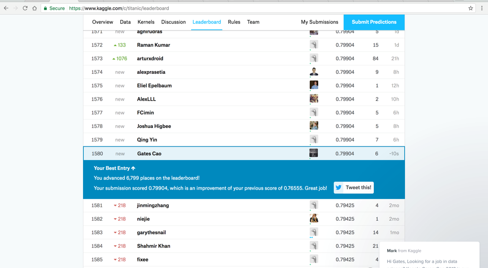

# Background
This analysis aims to predict survival of a given passenger of the Titanic. We obtained the dataset from Kaggle and used over 800 observations to perform modelling and cross-validation. Methods used include logistic regression, decision tree, bagging, random forest, boosting, KNN, LDA, and QDA. The decision tree method turned out to be the best because it provided a 0.799 testing accuracy. The testing accuracy was calculated by cross-validating with a separate test dataset, in which the column that represents survival is withheld by Kaggle.

# Dataset Description
We obtained the datasets from an ongoing competition on Kaggle. Kaggle provides two sets of data, a train dataset of 891 observations and a test dataset of 418 observations. Data on survival has been removed for the test dataset. Competitors use the train dataset to train and test their models and Kaggle uses the test dataset for ranking.

Aside from the difference on survival data, the train and test datsets have the same 11 other variables: `PassengerId`, `Pclass`, `Name`, `Sex`, `Age`, `SibSp`, `Parch`, `Ticket`, `Fare`, `Cabin`, `Embarked`. A definition of the variable names can be found on competition webpage at: https://www.kaggle.com/c/titanic/data.


# Data Preparation
### Missing Data
First we dropped four variables: `PassengerId`, `Name`, `Ticket`, and `Cabin` because they should not affect survival through any means.


We then went on to deal with missing variables. Roughly 20% of the observations do not have data on `Age` and 2 observations do not have data on `Embarked`.

```
## Survived   Pclass      Sex      Age    SibSp    Parch     Fare Embarked 
##        0        0        0      177        0        0        0        2
```

We replaced all missing `Age` data with the median age and missing `Embarked` data with "S" (Southampton), which is where most passengers embarked.


### Splitting Data for Cross Validation
The test dataset does not have data on survival, so we had to use some of the observations in the train dataset to cross-validate our models before submitting to Kaggle. We randomly selected 80% of the train dataset for training and used the remaining 20% for cross-validation.

```
## # A tibble: 713 x 8
##    Survived Pclass   Sex   Age SibSp Parch    Fare Embarked
##       <int>  <int> <chr> <dbl> <int> <int>   <dbl>    <chr>
##  1        0      2  male  44.0     1     0 26.0000        S
##  2        0      1  male  45.5     0     0 28.5000        S
##  3        1      3  male  26.0     0     0 56.4958        S
##  4        0      1  male  39.0     0     0  0.0000        S
##  5        0      2  male  30.0     0     0 13.0000        S
##  6        0      2  male  39.0     0     0 13.0000        S
##  7        0      3  male  21.0     0     0  8.6625        S
##  8        0      3  male  28.0     0     0  8.7125        C
##  9        0      1  male  62.0     0     0 26.5500        S
## 10        0      1  male  65.0     0     1 61.9792        C
## # ... with 703 more rows
```

```
## # A tibble: 141 x 8
##    Survived Pclass    Sex   Age SibSp Parch     Fare Embarked
##       <int>  <int>  <chr> <dbl> <int> <int>    <dbl>    <chr>
##  1        1      1 female    38     1     0  71.2833        C
##  2        0      1   male    54     0     0  51.8625        S
##  3        1      3 female    27     0     2  11.1333        S
##  4        0      3   male    20     0     0   8.0500        S
##  5        0      3 female    14     0     0   7.8542        S
##  6        1      2   male    28     0     0  13.0000        S
##  7        0      2   male    35     0     0  26.0000        S
##  8        1      3 female    38     1     5  31.3875        S
##  9        0      1   male    19     3     2 263.0000        S
## 10        0      1   male    42     1     0  52.0000        S
## # ... with 131 more rows
```

# Exploratory Data Analysis
To get some insights on the data before modelling, we first did some EDA.

### Age and Survival


At a survival rate of 60%, children under the age 10 are the age group that are most likely to survive. People in their thirties are also likely to survive, with a survival rate just below 50%. On the other hand, those above 60 and between 20 and 30 are the least likely to survive. We believe the lower survival rates of people between 10 and 30 is cause by the fact that a large number of passengers in the third class are in these two age groups. As we will see shortly, passengers in the third class have very lower survival rates.

### Cabin Class and Survival


Over 60% of the passengers from the first class survived while less than 30% of the passengers from the third class did. This result may be caused by two factors. Passengers from the first class were probably given priority to board the life rafts. Third-class cabins were also near the bottom of the ship, which made escaping to the deck much more difficult.

### Sex and survival


Nearly 75% of female passengers survived but less than 20% of male passengers did. This was not due to more females being first class passengers or more females being girls younger than 10 years old. Female passengers were indeed given priorities to board the life rafts.


```
## # A tibble: 6 x 4
## # Groups:   Pclass [3]
##   Pclass    Sex     n      freq
##    <int>  <chr> <int>     <dbl>
## 1      1 female    94 0.4351852
## 2      1   male   122 0.5648148
## 3      2 female    76 0.4130435
## 4      2   male   108 0.5869565
## 5      3 female   144 0.2932790
## 6      3   male   347 0.7067210
```

```
## # A tibble: 2 x 4
## # Groups:   Age [1]
##           Age    Sex     n     freq
##        <fctr>  <chr> <int>    <dbl>
## 1 (0.34,10.4] female    31 0.484375
## 2 (0.34,10.4]   male    33 0.515625
```

### Port of Embarkment and Survival


Interestingly, those who boarded at Cherbourg had a survival rate of 55%, over 60% higher than those who boarded at Southampton. This is perhaps due to the fact that over 50% of the Cherbourg passengers went to the first class. However, those 90% of Queeston passengers belonged to the third class but passengers who boarded at Queenstown still had a higher survival rate than Southampton. This may be due to random chance.


```
## # A tibble: 9 x 4
## # Groups:   Embarked [3]
##   Embarked Pclass     n       freq
##      <chr>  <int> <int>      <dbl>
## 1        C      1    85 0.50595238
## 2        C      2    17 0.10119048
## 3        C      3    66 0.39285714
## 4        Q      1     2 0.02597403
## 5        Q      2     3 0.03896104
## 6        Q      3    72 0.93506494
## 7        S      1   129 0.19969040
## 8        S      2   164 0.25386997
## 9        S      3   353 0.54643963
```

### No. of Siblings and Spouse on Board and Survival


Those with 1 or 2 spouse or siblings on board had the highest survival rate. The lower survival rate of those without any spouse or siblings on board was due to the fact that many of these passengering were from the third class.


```
## # A tibble: 3 x 4
## # Groups:   SibSp [1]
##   SibSp Pclass     n      freq
##   <int>  <int> <int>     <dbl>
## 1     0      1   137 0.2253289
## 2     0      2   120 0.1973684
## 3     0      3   351 0.5773026
```

### No. of Parents and Children on Board and Survival


Those with 1 to 3 parents or children on board are more likely to survive than those without any parents or children on board. One thing to note here is that there are 15 observations in total for those with 3 or more parents or children on board. Therefore, insights about those with 3 or more parents or children on board are likely inaccurate.


```
## # A tibble: 5 x 4
## # Groups:   Parch [3]
##   Parch    Sex     n  freq
##   <int>  <chr> <int> <dbl>
## 1     4 female     2   0.5
## 2     4   male     2   0.5
## 3     5 female     4   0.8
## 4     5   male     1   0.2
## 5     6 female     1   1.0
```

# Feature Generation


```
## <ggproto object: Class FacetWrap, Facet>
##     compute_layout: function
##     draw_back: function
##     draw_front: function
##     draw_labels: function
##     draw_panels: function
##     finish_data: function
##     init_scales: function
##     map: function
##     map_data: function
##     params: list
##     render_back: function
##     render_front: function
##     render_panels: function
##     setup_data: function
##     setup_params: function
##     shrink: TRUE
##     train: function
##     train_positions: function
##     train_scales: function
##     super:  <ggproto object: Class FacetWrap, Facet>
```


```
##  (Intercept)       Pclass          Sex          Age        SibSp 
##  1.385773486 -0.173196273 -0.505044603 -0.006467507 -0.050107037 
##     Embarked 
## -0.041488413
```

```
##  (Intercept)       Pclass          Sex          Age        SibSp 
##  1.385773486 -0.173196273 -0.505044603 -0.006467507 -0.050107037 
##     Embarked 
## -0.041488413
```

```
##  (Intercept)       Pclass          Sex          Age        SibSp 
##  1.385773486 -0.173196273 -0.505044603 -0.006467507 -0.050107037 
##     Embarked 
## -0.041488413
```

We used best subset selection, forward stepwise selection, and backward stepwise selection methods. All three methods suggested using five predictors: `Pclass`, `Sex`, `Age`, `SibSp`, `Embarked`. However, we also tried training the models with all predictors. Results were more accurate for every model with all predictors than just using the five predicted suggested. Therefore, we opted to use all predictors instead.

# Model Selection
Before selecting any model, we recoded `Sex` into `female = 0`, `male = 1` and `Embarked` into `C = 0`, `Q = 1`, `S = 2`. This makes it easier to apply some of our models.


We used eight methods:

* Logistic regression
* Decision tree
* Bagging
* Random forest
* Boosting
* KNN
* LDA
* QDA


```
##      Survived
## probs  0  1
##     0 70 21
##     1 11 39
```

```
## [1] 0.7730496
```

```
## Rattle: A free graphical interface for data science with R.
## Version 5.1.0 Copyright (c) 2006-2017 Togaware Pty Ltd.
## Type 'rattle()' to shake, rattle, and roll your data.
```

```
## 
## Classification tree:
## tree(formula = Survived ~ ., data = training)
## Variables actually used in tree construction:
## [1] "probs"  "Age"    "SibSp"  "Pclass" "Sex"   
## Number of terminal nodes:  7 
## Residual mean deviance:  0.8293 = 585.5 / 706 
## Misclassification error rate: 0.1767 = 126 / 713
```

```
##           
## tree_preds  0  1
##          0 69 18
##          1 12 42
```

```
## [1] 0.787234
```

```
## $size
## [1] 7 4 2 1
## 
## $dev
## [1] 141 140 139 275
## 
## $k
## [1]  -Inf   0.0   6.5 136.0
## 
## $method
## [1] "misclass"
## 
## attr(,"class")
## [1] "prune"         "tree.sequence"
```

```
## Error in predict(prune, validation, type = "class"): object 'prune' not found
```

```
##           
## tree_preds  0  1
##          0 69 18
##          1 12 42
```

```
## [1] 0.787234
```

```
## Error in model.frame.default(Terms, newdata, na.action = na.pass, xlev = object$xlevels): variable lengths differ (found for 'probs')
```

```
## Error in mutate_impl(.data, dots): Column `Survived` must be length 418 (the number of rows) or one, not 141
```

```
## Error in is.data.frame(x): object 'tree_test' not found
```

```
## randomForest 4.6-12
```

```
## Type rfNews() to see new features/changes/bug fixes.
```

```
## 
## Attaching package: 'randomForest'
```

```
## The following object is masked from 'package:rattle':
## 
##     importance
```

```
## The following object is masked from 'package:dplyr':
## 
##     combine
```

```
## The following object is masked from 'package:ggplot2':
## 
##     margin
```

```
## 
## Call:
##  randomForest(formula = Survived ~ ., data = training, mtry = 7,      importance = TRUE) 
##                Type of random forest: classification
##                      Number of trees: 500
## No. of variables tried at each split: 7
## 
##         OOB estimate of  error rate: 18.79%
## Confusion matrix:
##     0   1 class.error
## 0 379  59   0.1347032
## 1  75 200   0.2727273
```

```
##          
## bag_preds  0  1
##         0 67 16
##         1 14 44
```

```
## [1] 0.787234
```

```
## Error in model.frame.default(Terms, newdata, na.action = na.omit): variable lengths differ (found for 'probs')
```

```
## Error in mutate_impl(.data, dots): Column `Survived` must be length 418 (the number of rows) or one, not 141
```

```
## Error in is.data.frame(x): object 'bag_test' not found
```

```
##         
## rf_preds  0  1
##        0 69 18
##        1 12 42
```

```
## [1] 0.787234
```

```
## Error in model.frame.default(Terms, newdata, na.action = na.omit): variable lengths differ (found for 'probs')
```

```
## Error in mutate_impl(.data, dots): Column `Survived` must be length 418 (the number of rows) or one, not 141
```

```
## Error in is.data.frame(x): object 'rf_test' not found
```

```
## Error in library(gbm): there is no package called 'gbm'
```

```
## Error in gbm(Survived ~ ., data = training, distribution = "gaussian", : could not find function "gbm"
```

```
## Error in predict(boost_fit, validation, n.trees = 5000): object 'boost_fit' not found
```

```
## Error in ifelse(boost_preds > 1.5, 1, 0): object 'boost_preds' not found
```

```
## Error in table(boost_preds, validation$Survived): object 'boost_preds' not found
```

```
## Error in mean(boost_preds == validation$Survived): object 'boost_preds' not found
```

```
## Error in predict(boost_fit, test, n.trees = 5000): object 'boost_fit' not found
```

```
## Error in ifelse(boost_preds > 1.5, 1, 0): object 'boost_preds' not found
```

```
## Error in mutate_impl(.data, dots): Binding not found: boost_preds.
```

```
## Error in is.data.frame(x): object 'boost_test' not found
```

```
## Error in table(knn_pred, validation_knn$Survived): object 'knn_pred' not found
```

```
## Error in mean(knn_pred == validation_knn$Survived): object 'knn_pred' not found
```

```
## Error in knn(train_X, test_X, t(train_survival), k = 3): no missing values are allowed
```

```
## Error in mutate_impl(.data, dots): Column `Survived` must be length 418 (the number of rows) or one, not 141
```

```
## Error in is.data.frame(x): object 'knn_test' not found
```

```
## 
## Attaching package: 'MASS'
```

```
## The following object is masked from 'package:dplyr':
## 
##     select
```

```
## Call:
## lda(Survived ~ ., data = training)
## 
## Prior probabilities of groups:
##         0         1 
## 0.6143058 0.3856942 
## 
## Group means:
##     Pclass       Sex      Age     SibSp     Parch     Fare Embarked
## 0 2.520548 0.8493151 29.78767 0.5799087 0.3493151 23.07068 1.614155
## 1 1.941818 0.3163636 27.66578 0.4872727 0.4872727 49.99479 1.330909
##       probs
## 0 0.1347032
## 1 0.7090909
## 
## Coefficients of linear discriminants:
##                    LD1
## Pclass   -0.6178265814
## Sex      -1.6145636226
## Age      -0.0228093054
## SibSp    -0.1658802362
## Parch    -0.0343786128
## Fare      0.0007631747
## Embarked -0.1140852498
## probs     0.6296113578
```


```
## [1] "class"     "posterior" "x"
```

```
##          
## lda_class  0  1
##         0 70 21
##         1 11 39
```

```
## [1] 0.7730496
```

```
## Error in model.frame.default(Terms, newdata, na.action = na.pass, xlev = object$xlevels): variable lengths differ (found for 'probs')
```

```
## Error in mutate_impl(.data, dots): Binding not found: lda_preds.
```

```
## Error in is.data.frame(x): object 'lda_test' not found
```

```
## Call:
## qda(Survived ~ ., data = training)
## 
## Prior probabilities of groups:
##         0         1 
## 0.6143058 0.3856942 
## 
## Group means:
##     Pclass       Sex      Age     SibSp     Parch     Fare Embarked
## 0 2.520548 0.8493151 29.78767 0.5799087 0.3493151 23.07068 1.614155
## 1 1.941818 0.3163636 27.66578 0.4872727 0.4872727 49.99479 1.330909
##       probs
## 0 0.1347032
## 1 0.7090909
```

```
## Error in xy.coords(x, y, xlabel, ylabel, log): 'x' is a list, but does not have components 'x' and 'y'
```

```
## [1] "class"     "posterior"
```

```
##          
## qda_class  0  1
##         0 69 18
##         1 12 42
```

```
## [1] 0.787234
```

```
## Error in model.frame.default(as.formula(delete.response(Terms)), newdata, : variable lengths differ (found for 'probs')
```

```
## Error in mutate_impl(.data, dots): Binding not found: qda_preds.
```

Their respective accuracies are listed below:

```
## # A tibble: 8 x 2
##                 Model Accuracy
##                 <chr>    <dbl>
## 1       Decision Tree  0.79904
## 2       Random Forest  0.78947
## 3            Boosting  0.77511
## 4                 QDA  0.76076
## 5                 LDA  0.75119
## 6 Logistic Regression  0.74612
## 7             Bagging  0.73502
## 8                 KNN  0.57894
```

All models work fairly well except for KNN. Decision tree provides the best accuracy at 0.799.

We also uploaded our analysis to Kaggle and ranked 1580th among over 10,000 competitors.


# Discussion


